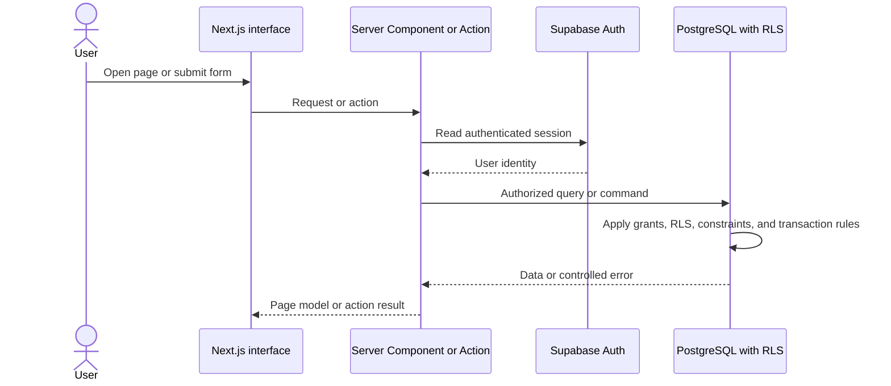

# School Friends Dhukuti Tracking Website

## API Design Document

| Document field | Value |
|---|---|
| Status | Proposed V1 API design |
| Application | Next.js with TypeScript |
| API style | Server Actions and server-side query functions |
| Related PRD | [Product Requirements Document](./Dhukuti_Tracking_Website_PRD.md) |
| Related architecture | [System Design Document](./Dhukuti_Tracking_Website_System_Design.md) |
| Related database design | [Database Design Document](./Dhukuti_Tracking_Website_Database_Design.md) |
| Document date | 18 September 2026 |

## 1 Purpose

This document defines how the Next.js application reads and changes Dhukuti data. It covers the internal API style, query and command operations, input and output contracts, authorization, validation, error handling, transactions, duplicate prevention, caching, testing, and a future REST mapping.

## 2 API decision

Version 1 will not expose a public REST API. The website is the only client, so it will use:

- React Server Components for page data
- Server-side query functions for reads
- Next.js Server Actions for administrator mutations
- PostgreSQL functions for multi-record transactions
- Route Handlers only for authentication callbacks and future downloads or integrations

This design avoids an unnecessary HTTP layer while keeping every operation explicit and testable.

If a mobile application or external integration is added later, the same domain operations can be exposed through versioned REST endpoints.

## 3 API principles

- Treat the database as the source of truth.
- Never accept calculated monthly amounts from the browser.
- Express changes as business commands rather than generic table updates.
- Verify authentication and authorization on every operation.
- Validate input on the server.
- Make multi-record financial changes atomic.
- Use stable error codes for interface behavior.
- Return only the data required by the current page.
- Keep read and write operations separate.
- Prevent duplicate actions through constraints and idempotent behavior.

## 4 Request flow



## 5 Authentication and authorization

The website has two login identities:

- Administrator
- Shared member

Every protected operation reads the authenticated Supabase session. The API does not trust a role supplied by the browser.

Authorization rules:

| Operation category | Administrator | Shared member | Unauthenticated |
|---|:---:|:---:|:---:|
| Read dashboard and history | Yes | Yes | No |
| Create or update cycles | Yes | No | No |
| Record winners | Yes | No | No |
| Record or correct payments | Yes | No | No |
| Record extra contributions | Yes | No | No |
| Change meeting dates | Yes | No | No |

Server Actions verify the administrator role before attempting a mutation. PostgreSQL Row Level Security performs the same check again.

## 6 Shared types

Recommended TypeScript types:

```ts
type UserRole = "admin" | "member"

type CycleStatus = "draft" | "active" | "completed"

type MonthStatus = "draft" | "open" | "completed"

type PaymentStatus = "pending" | "paid"

type PaymentMethod = "esewa" | "bank_transfer" | "cash"
```

The database and TypeScript application must use the same controlled values.

## 7 Standard action result

All Server Actions should return a discriminated result.

```ts
type ActionSuccess<T> = {
  success: true
  data: T
}

type ActionFailure = {
  success: false
  error: {
    code: ApiErrorCode
    message: string
    fields?: Record<string, string>
  }
}

type ActionResult<T> = ActionSuccess<T> | ActionFailure
```

The interface uses `code` for behavior and `message` for the user-facing explanation.

## 8 Error codes

```ts
type ApiErrorCode =
  | "UNAUTHENTICATED"
  | "FORBIDDEN"
  | "NOT_FOUND"
  | "VALIDATION_ERROR"
  | "CONFLICT"
  | "INVALID_CYCLE_STATE"
  | "INVALID_MONTH_STATE"
  | "MEMBER_NOT_IN_CYCLE"
  | "MEMBER_ALREADY_WON"
  | "WINNER_ALREADY_SELECTED"
  | "PAYMENT_ALREADY_PAID"
  | "PAYMENT_ALREADY_PENDING"
  | "INVALID_PAYMENT_METHOD"
  | "CYCLE_ROSTER_LOCKED"
  | "DATABASE_ERROR"
```

Expected behavior:

| Code | Interface behavior |
|---|---|
| `UNAUTHENTICATED` | Redirect to login |
| `FORBIDDEN` | Show an access-denied message |
| `VALIDATION_ERROR` | Show field-level errors |
| `CONFLICT` | Refresh the affected data and explain the conflict |
| State errors | Keep the form open and explain the required state |
| `DATABASE_ERROR` | Show a generic failure and log the internal details securely |

Raw database messages must not be returned to the browser.

## 9 Query operations

Query functions are server-only and do not mutate data.

### 9.1 `getDashboard`

Purpose: return one complete dashboard model.

```ts
type GetDashboardInput = {
  cycleId?: string
  monthId?: string
}
```

Suggested response:

```ts
type DashboardData = {
  cycle: {
    id: string
    number: number
    status: CycleStatus
    currentMonth: number
    totalMonths: number
  }
  collection: {
    totalDue: number
    received: number
    pending: number
    paidMembers: number
    pendingMembers: number
    totalMembers: number
  }
  saving: {
    balance: number
    carriedFromPreviousCycles: number
    fixedSaving: number
    interest: number
    extraContributions: number
    pendingSaving: number
  }
  winner: {
    memberId: string
    name: string
    payout: number
  } | null
  winnerProgress: {
    completed: number
    remaining: number
  }
  nextMeeting: {
    date: string
    daysRemaining: number
    overridden: boolean
  } | null
}
```

The frontend must not calculate financial totals from raw records when the server can return the complete dashboard model.

### 9.2 `listCycles`

```ts
type CycleListItem = {
  id: string
  number: number
  status: CycleStatus
  memberCount: number
  completedMonths: number
  totalMonths: number
  startedOn: string | null
  completedOn: string | null
}
```

### 9.3 `getCycle`

Returns:

- Cycle rules
- Roster
- Month list
- Winner progress
- Saving totals

### 9.4 `getMonth`

```ts
type GetMonthInput = {
  monthId: string
}
```

Returns:

- Month number and schedule
- Month status
- Winner and payout
- Eleven member payment rows for Cycle 1
- Collection summary
- Saving added during the month
- Last-updated timestamps

### 9.5 `getSavingSummary`

```ts
type GetSavingSummaryInput = {
  cycleId?: string
}
```

Returns fixed saving, interest, extra contributions, pending saving, cycle total, and overall carried balance.

### 9.6 `getTransactionHistory`

```ts
type GetTransactionHistoryInput = {
  cycleId?: string
  monthId?: string
  memberId?: string
  recordType?: "monthly_payment" | "extra_contribution"
}
```

The result is ordered by cycle, month, and recorded timestamp. Pagination is optional in Version 1 because the dataset is small.

### 9.7 `listMembers`

Returns active members and, when requested, inactive historical members.

### 9.8 `getWinnerProgress`

Returns each cycle member, whether they won, their winning month, and current eligibility.

## 10 Command operations

### 10.1 `createCycle`

Permission: administrator.

```ts
type CreateCycleInput = {
  contributionAmount: number
  fixedSavingAmount: number
  interestAmount: number
  startedOn: string
  memberIds: string[]
}
```

Validation:

- Rule amounts are whole, non-negative rupees.
- Contribution amount is greater than zero.
- Roster contains no duplicate member.
- Every selected member is active.
- The cycle remains `draft` after creation.

### 10.2 `updateCycleRoster`

Permission: administrator.

Allowed only while the cycle is `draft`.

```ts
type UpdateCycleRosterInput = {
  cycleId: string
  memberIds: string[]
}
```

### 10.3 `activateCycle`

Permission: administrator.

```ts
type ActivateCycleInput = {
  cycleId: string
  expectedUpdatedAt: string
  confirmation: true
}
```

The database operation:

1. Locks the cycle and rejects activation if its `updated_at` differs from the reviewed `expectedUpdatedAt` value. Preserve the database timestamp precision when submitting it.
2. Validates the roster and rule amounts.
3. Saves the member-count snapshot.
4. Generates the monthly schedule.
5. Changes the status to `active`.

The interface requires a fresh confirmation whenever the cycle or draft version changes. A stale activation leaves the cycle in draft with no generated months and asks the administrator to reload and review it again.

### 10.4 `setMonthWinner`

Permission: administrator.

```ts
type SetMonthWinnerInput = {
  monthId: string
  winnerMemberId: string
}
```

The operation must be atomic:

1. Validate the administrator.
2. Lock the month.
3. Confirm that the month has no winner.
4. Confirm that the member belongs to the cycle.
5. Confirm that the member has not won in the cycle.
6. Save the winner.
7. Generate one payment snapshot per cycle member.
8. Change the month status to `open`.
9. Commit everything together.

Suggested response:

```ts
type SetMonthWinnerResult = {
  monthId: string
  winner: {
    memberId: string
    name: string
  }
  payout: number
  generatedPaymentCount: number
}
```

### 10.5 `updateMeetingDate`

Permission: administrator.

```ts
type UpdateMeetingDateInput = {
  monthId: string
  scheduledDate: string
}
```

The date must be a valid Gregorian date. Changing one month must not change any future month.

### 10.6 `markPaymentPaid`

Permission: administrator.

```ts
type MarkPaymentPaidInput = {
  paymentId: string
  method: PaymentMethod
}
```

The browser does not submit an amount. The server uses the calculated obligation stored in the database.

The operation:

1. Load and lock the payment record.
2. Confirm that it exists.
3. Set the status to `paid`.
4. Save the method.
5. Set `paid_at` automatically.
6. Return updated monthly and saving summaries.

Suggested response:

```ts
type PaymentMutationResult = {
  payment: {
    id: string
    status: PaymentStatus
    method: PaymentMethod | null
    totalDue: number
    paidAt: string | null
    updatedAt: string
  }
  monthSummary: {
    received: number
    pending: number
    paidMembers: number
    pendingMembers: number
  }
  savingBalance: number
}
```

### 10.7 `markPaymentPending`

Permission: administrator.

This is a correction operation.

```ts
type MarkPaymentPendingInput = {
  paymentId: string
  confirmation: true
}
```

It clears `payment_method` and `paid_at`, updates `updated_at`, and recalculates summaries.

### 10.8 `addExtraContribution`

Permission: administrator.

```ts
type AddExtraContributionInput = {
  cycleId: string
  monthId?: string
  memberId: string
  amount: number
  method: PaymentMethod
  reason?: string
}
```

Validation:

- Amount is a positive whole-rupee value.
- Contributor belongs to the selected cycle.
- Optional month belongs to the selected cycle.
- Reason is trimmed and length-limited.

### 10.9 `updateExtraContribution`

Permission: administrator.

```ts
type UpdateExtraContributionInput = {
  contributionId: string
  amount: number
  method: PaymentMethod
  reason?: string
}
```

### 10.10 `completeMonth`

Permission: administrator.

```ts
type CompleteMonthInput = {
  monthId: string
}
```

Completion checks:

- Winner exists.
- Member payment snapshots exist for the entire roster.
- The administrator confirms completion.

Pending payments may remain. They stay attached to their original month and can be corrected later.

### 10.11 `completeCycle`

Permission: administrator.

Completion checks:

- Every expected month exists.
- Every member won exactly once.
- Every month is completed.

### 10.12 `startNextCycle`

This can be implemented as `createCycle` followed by roster review and `activateCycle`. It does not need special balance-copying logic because the overall saving balance is derived from all historical cycles.

## 11 Input validation

Use server-side schemas, such as Zod schemas, for every action.

Validation layers:

1. Interface validation for immediate feedback
2. Server schema validation for security
3. Domain validation for state rules
4. Database constraints and RLS for final enforcement

The interface must not be treated as a security boundary.

## 12 Atomic operations

The following commands require database transactions:

- Activating a cycle and generating its months
- Setting a winner and generating member payments
- Completing a cycle

Simple one-row updates such as marking a payment paid can use a direct update, but database constraints still enforce status consistency.

## 13 Duplicate and retry behavior

Network retries and double-clicks must not create duplicate financial records.

Recommended behavior:

- Disable a form while its action is running.
- Use unique database constraints as the final protection.
- Treat marking an already-paid record paid with the same method as a successful no-op.
- Reject changing an already-selected winner with `WINNER_ALREADY_SELECTED`.
- Reject a second winning month with `MEMBER_ALREADY_WON`.
- Use a client-generated request ID for extra contributions if duplicate submissions become a practical issue.

## 14 Concurrency

Only one administrator exists in Version 1, so complex optimistic locking is unnecessary.

Critical operations still use row locking:

- Setting a winner locks the month.
- Activating a cycle locks the cycle.
- Completing a cycle locks the cycle and validates all months.

For ordinary corrections, the most recent administrator update wins and `updated_at` changes.

## 15 Data refresh and caching

Financial data should favor correctness over aggressive caching.

- Server Components query current data.
- Successful mutations revalidate affected pages.
- Dashboard, current month, history, and saving pages must refresh after a payment correction.
- Long-lived static caching is not appropriate for active financial pages.
- Public content caching is irrelevant because all product pages require authentication.

## 16 Logging

Log operation names and identifiers, not secrets or passwords.

Recommended mutation log fields:

```text
operation
authenticated user ID
cycle ID
month ID
record ID
success or failure
error code
request identifier
server timestamp
```

Version 1 does not require a user-visible detailed audit log. Operational logs remain useful for diagnosing failures.

## 17 Security requirements

- Use authenticated, secure session cookies.
- Verify the role inside every mutation.
- Rely on RLS as an independent authorization layer.
- Never expose the Supabase service-role key to the browser.
- Do not accept calculated totals from the client.
- Do not return internal database exceptions.
- Validate IDs and amounts before database access.
- Rate-limit repeated login attempts through the authentication provider.
- Reject cross-cycle references, such as attaching a contribution to a month in another cycle.

## 18 Future REST mapping

If a mobile application or integration is added later, the internal operations can map to these endpoints:

```text
GET    /api/v1/dashboard
GET    /api/v1/cycles
POST   /api/v1/cycles
GET    /api/v1/cycles/:cycleId
PATCH  /api/v1/cycles/:cycleId/roster
POST   /api/v1/cycles/:cycleId/activate
POST   /api/v1/cycles/:cycleId/complete

GET    /api/v1/months/:monthId
POST   /api/v1/months/:monthId/winner
PATCH  /api/v1/months/:monthId/schedule
POST   /api/v1/months/:monthId/complete

PATCH  /api/v1/monthly-payments/:paymentId/paid
PATCH  /api/v1/monthly-payments/:paymentId/pending

GET    /api/v1/savings
GET    /api/v1/transactions
POST   /api/v1/extra-contributions
PATCH  /api/v1/extra-contributions/:contributionId
```

Suggested HTTP status mapping:

| Result | Status |
|---|---:|
| Successful read or update | 200 |
| Successful creation | 201 |
| Validation failure | 422 |
| Unauthenticated | 401 |
| Forbidden | 403 |
| Not found | 404 |
| State or uniqueness conflict | 409 |
| Unexpected server failure | 500 |

REST is not required for the V1 website.

## 19 API tests

### 19.1 Query tests

- Dashboard returns correct Cycle 1 totals.
- Pending saving is separate from actual saving.
- Transaction filters return only matching records.
- Winner progress identifies the one remaining Month 11 member.
- Member responses contain no editing capability information that bypasses authorization.

### 19.2 Command tests

- Member account cannot execute administrator actions.
- Setting a winner generates one obligation per cycle member.
- Current winner receives the correct रु 100 obligation in Cycle 1.
- Previous winners receive the correct रु 2,300 obligation.
- Unselected members receive the correct रु 2,100 obligation.
- Marking paid requires a valid method.
- The API ignores any attempted client-supplied regular payment amount.
- Returning a payment to pending reduces collected and saving totals.
- Extra contributions affect saving but not winner payout.
- Meeting-date overrides affect only the selected month.
- A member cannot win twice.

### 19.3 Transaction tests

- A failed winner-generation operation creates no partial payment rows.
- Two winner requests cannot create two winners.
- Repeating the same paid operation does not duplicate a payment.
- Completing a cycle fails unless every member won once.

## 20 Implementation order

1. Implement shared types and validation schemas.
2. Implement authentication and role helpers.
3. Implement server-side queries.
4. Implement cycle creation and activation.
5. Implement atomic winner generation.
6. Implement payment mutations.
7. Implement extra contributions.
8. Implement completion and correction operations.
9. Connect page revalidation.
10. Add integration and end-to-end tests.

## 21 Final API decision

Version 1 will use a private server-side API inside the Next.js application. Reads use Server Components and query functions. Writes use Server Actions. PostgreSQL functions handle multi-record transactions. A public REST API will be introduced only if a future client requires it.

## 22 References

- [Next.js backend for frontend guidance](https://nextjs.org/docs/app/guides/backend-for-frontend)
- [Supabase Next.js quickstart](https://supabase.com/docs/guides/getting-started/quickstarts/nextjs)
- [Supabase Row Level Security](https://supabase.com/docs/guides/database/postgres/row-level-security)
- [Supabase authentication architecture](https://supabase.com/docs/guides/auth/architecture)
