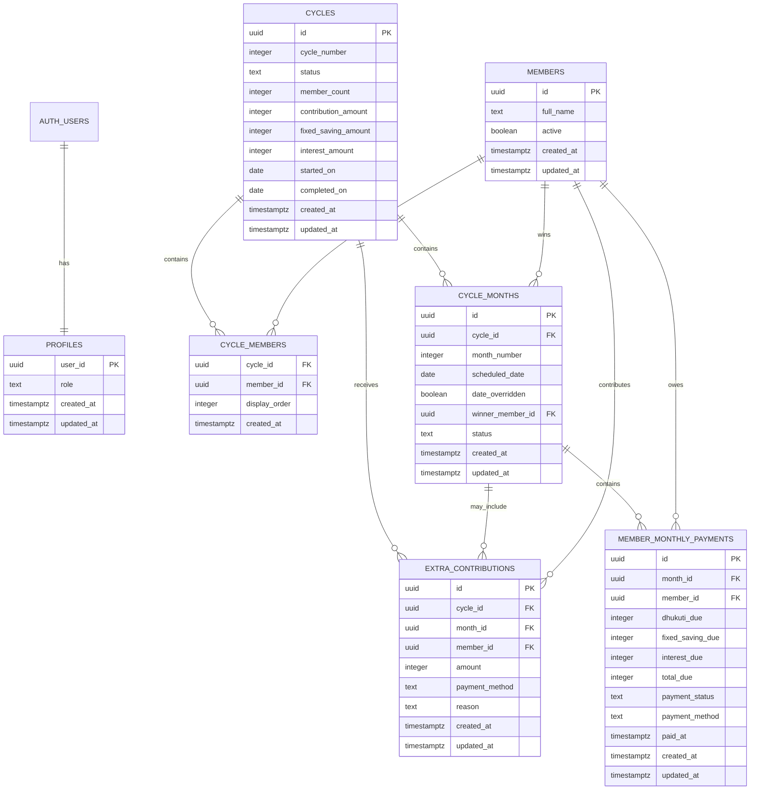

# School Friends Dhukuti Tracking Website

## Database Design Document

| Document field | Value |
|---|---|
| Status | Proposed V1 database design |
| Database | Supabase PostgreSQL |
| Related PRD | [Product Requirements Document](./Dhukuti_Tracking_Website_PRD.md) |
| Related architecture | [System Design Document](./Dhukuti_Tracking_Website_System_Design.md) |
| Document date | 18 September 2026 |

## 1 Purpose

This document defines the PostgreSQL data model for the Dhukuti tracking website. It covers tables, relationships, constraints, calculated values, security policies, summary views, indexing, historical data migration, and database testing.

The database is the source of truth for winners, member obligations, received payments, and saving-fund contributions. Dashboard totals must be derived from these records and must not depend on a manually editable balance.

## 2 Design principles

- Preserve completed financial history.
- Derive balances from source records.
- Use whole Nepalese rupees and integer arithmetic.
- Store the rules that applied to each cycle as historical snapshots.
- Keep authentication accounts separate from group members.
- Enforce critical business rules inside PostgreSQL.
- Use Row Level Security for administrator and member permissions.
- Avoid deleting records that contribute to financial history.
- Support a different member roster in a future cycle.
- Keep Version 1 simple enough to maintain without a separate accounting service.

## 3 Scope assumptions

Cycle 1 has 11 members, lasts 11 months, and uses these rules:

| Rule | Cycle 1 value |
|---|---:|
| Dhukuti contribution | रु 2,000 |
| Fixed saving per member per month | रु 100 |
| Interest paid by a previous winner | रु 200 |
| Winner payout | रु 20,000 |
| Expected baseline saving after Month 10 | रु 20,000 |
| Expected baseline saving after Month 11 | रु 23,100 |

The database supports a different roster and different rule amounts in future cycles. Once a cycle becomes active, its roster and financial rules are locked.

## 4 Logical data model



## 5 Authentication data and group data

Supabase Auth manages login identities in `auth.users`. Application data must not write directly to that schema.

The two V1 authentication accounts are:

- One administrator account
- One shared read-only member account

The `profiles` table stores each account's application role. The `members` table stores the school friends who participate in Dhukuti cycles. A friend is not required to have an authentication account.

This separation prevents the shared member login from being confused with a particular friend's financial records.

## 6 Table specifications

### 6.1 profiles

| Column | Type | Null | Rules |
|---|---|:---:|---|
| `user_id` | `uuid` | No | Primary key and foreign key to `auth.users.id` |
| `role` | `text` | No | Check: `admin` or `member` |
| `created_at` | `timestamptz` | No | Default `now()` |
| `updated_at` | `timestamptz` | No | Default `now()` and updated automatically |

The table contains only the two application profiles in Version 1.

### 6.2 members

| Column | Type | Null | Rules |
|---|---|:---:|---|
| `id` | `uuid` | No | Primary key, generated automatically |
| `full_name` | `text` | No | Trimmed, non-empty name |
| `active` | `boolean` | No | Default `true` |
| `created_at` | `timestamptz` | No | Default `now()` |
| `updated_at` | `timestamptz` | No | Updated automatically |

Members with financial history must not be deleted. Set `active` to `false` when someone should not be offered for a future cycle.

### 6.3 cycles

| Column | Type | Null | Rules |
|---|---|:---:|---|
| `id` | `uuid` | No | Primary key |
| `cycle_number` | `integer` | No | Positive and unique |
| `status` | `text` | No | `draft`, `active`, or `completed` |
| `member_count` | `integer` | No | Positive; set when cycle becomes active |
| `contribution_amount` | `integer` | No | Positive whole rupees; Cycle 1 uses `2000` |
| `fixed_saving_amount` | `integer` | No | Non-negative; Cycle 1 uses `100` |
| `interest_amount` | `integer` | No | Non-negative; Cycle 1 uses `200` |
| `started_on` | `date` | Yes | Required before activation |
| `completed_on` | `date` | Yes | Set when completed |
| `created_at` | `timestamptz` | No | Default `now()` |
| `updated_at` | `timestamptz` | No | Updated automatically |

The rule amounts are cycle snapshots. They must not be updated after the cycle becomes active.

### 6.4 cycle_members

| Column | Type | Null | Rules |
|---|---|:---:|---|
| `cycle_id` | `uuid` | No | Foreign key to `cycles.id` |
| `member_id` | `uuid` | No | Foreign key to `members.id` |
| `display_order` | `integer` | Yes | Optional stable interface order |
| `created_at` | `timestamptz` | No | Default `now()` |

Primary key:

```text
(cycle_id, member_id)
```

The roster can be edited while the cycle is `draft`. It becomes locked when the cycle is activated.

### 6.5 cycle_months

| Column | Type | Null | Rules |
|---|---|:---:|---|
| `id` | `uuid` | No | Primary key |
| `cycle_id` | `uuid` | No | Foreign key to `cycles.id` |
| `month_number` | `integer` | No | From 1 through the cycle member count |
| `scheduled_date` | `date` | No | Last Saturday by default; administrator may override |
| `date_overridden` | `boolean` | No | Default `false` |
| `winner_member_id` | `uuid` | Yes | Empty until winner is selected |
| `status` | `text` | No | `draft`, `open`, or `completed` |
| `created_at` | `timestamptz` | No | Default `now()` |
| `updated_at` | `timestamptz` | No | Updated automatically |

Required uniqueness:

```text
unique (cycle_id, month_number)
unique (cycle_id, winner_member_id) where winner_member_id is not null
```

The winner must appear in `cycle_members` for the same cycle. A composite foreign key or transactional database function must enforce this condition.

### 6.6 member_monthly_payments

| Column | Type | Null | Rules |
|---|---|:---:|---|
| `id` | `uuid` | No | Primary key |
| `month_id` | `uuid` | No | Foreign key to `cycle_months.id` |
| `member_id` | `uuid` | No | Foreign key to `members.id` |
| `dhukuti_due` | `integer` | No | Zero or the cycle contribution amount |
| `fixed_saving_due` | `integer` | No | Cycle fixed-saving amount |
| `interest_due` | `integer` | No | Zero or the cycle interest amount |
| `total_due` | `integer` | No | Generated from the three components |
| `payment_status` | `text` | No | `pending` or `paid` |
| `payment_method` | `text` | Yes | `esewa`, `bank_transfer`, or `cash` |
| `paid_at` | `timestamptz` | Yes | Recorded automatically when marked paid |
| `created_at` | `timestamptz` | No | Default `now()` |
| `updated_at` | `timestamptz` | No | Updated automatically |

Required uniqueness:

```text
unique (month_id, member_id)
```

Recommended generated column:

```sql
total_due integer generated always as (
  dhukuti_due + fixed_saving_due + interest_due
) stored
```

Payment consistency checks:

```text
paid    -> payment_method is required and paid_at is required
pending -> payment_method is null and paid_at is null
```

Partial payments are intentionally not represented.

### 6.7 extra_contributions

| Column | Type | Null | Rules |
|---|---|:---:|---|
| `id` | `uuid` | No | Primary key |
| `cycle_id` | `uuid` | No | Foreign key to `cycles.id` |
| `month_id` | `uuid` | Yes | Optional foreign key to `cycle_months.id` |
| `member_id` | `uuid` | No | Contributor |
| `amount` | `integer` | No | Greater than zero |
| `payment_method` | `text` | No | `esewa`, `bank_transfer`, or `cash` |
| `reason` | `text` | Yes | Optional public explanation |
| `created_at` | `timestamptz` | No | Default `now()`; no manual date input |
| `updated_at` | `timestamptz` | No | Updated automatically |

If `month_id` is present, the selected month must belong to the selected cycle.

## 7 Controlled values

PostgreSQL `text` columns with check constraints are recommended for Version 1 because they are easier to evolve than database enum types.

```text
profile role:
  admin
  member

cycle status:
  draft
  active
  completed

month status:
  draft
  open
  completed

payment status:
  pending
  paid

payment method:
  esewa
  bank_transfer
  cash
```

TypeScript should define equivalent union types so the application and database use the same values.

## 8 Calculation rules

### 8.1 Monthly member obligation

```text
Current winner
  Dhukuti: 0
  Fixed saving: cycle.fixed_saving_amount
  Interest: 0

Member who won in an earlier month
  Dhukuti: cycle.contribution_amount
  Fixed saving: cycle.fixed_saving_amount
  Interest: cycle.interest_amount

Member who has not yet won
  Dhukuti: cycle.contribution_amount
  Fixed saving: cycle.fixed_saving_amount
  Interest: 0
```

The amounts are saved as snapshots when a winner is selected. Old records are not recalculated when future cycle rules change.

### 8.2 Winner payout

```text
winner payout
= (cycle.member_count - 1)
× cycle.contribution_amount
```

For Cycle 1:

```text
(11 - 1) × रु 2,000 = रु 20,000
```

### 8.3 Actual saving balance

```text
actual saving balance
= sum(fixed_saving_due for paid member payments)
+ sum(interest_due for paid member payments)
+ sum(extra contribution amounts)
```

Pending records do not increase the actual balance.

### 8.4 Pending saving

```text
pending saving
= sum(fixed_saving_due for pending member payments)
+ sum(interest_due for pending member payments)
```

Pending saving is shown separately and is not included in the balance.

## 9 Transactional database functions

### 9.1 `activate_cycle`

Responsibilities:

1. Lock the draft cycle.
2. Validate the roster.
3. Save the member count.
4. Validate the financial rules.
5. Generate the required monthly schedule.
6. Change the cycle status to `active`.

### 9.2 `set_month_winner_and_generate_payments`

Responsibilities:

1. Lock the selected month.
2. Confirm that it has no winner.
3. Confirm that the selected member belongs to the cycle.
4. Confirm that the member has not already won.
5. Save the winner.
6. Generate one monthly payment snapshot for every cycle member.
7. Change the month status to `open`.
8. Commit all changes together.

If any step fails, the entire transaction rolls back.

### 9.3 `correct_month_winner_and_rebuild_payments`

Responsibilities:

1. Require administrator access and lock the cycle, its months, and the affected payment snapshots.
2. Confirm that the replacement member belongs to the cycle and has not won another month.
3. Reject the correction when the selected month or any later recorded month has a received payment.
4. Replace the winner and rebuild every pending obligation snapshot from that month onward, including later winner-interest amounts.
5. Compare the reviewed month timestamp before changing any record.
6. Commit all changes together so summaries never observe a partially corrected history.

The function updates existing payment records rather than deleting historical rows. The administrator must first return affected received payments to pending when a correction would change them.

### 9.4 `complete_cycle`

Responsibilities:

1. Confirm that every expected month exists.
2. Confirm that every cycle member won exactly once.
3. Confirm that every month is completed.
4. Set the cycle status and completion date.

Pending payments may remain attached to their original completed month unless the product later decides to block completion when payments are pending.

## 10 Derived views

Views must use invoker security so they respect the underlying Row Level Security policies.

### 10.1 `monthly_collection_summary`

One row per month containing:

- Total amount due
- Total amount received
- Total amount pending
- Paid member count
- Pending member count
- Dhukuti amount collected
- Fixed saving received
- Interest received
- Calculated winner payout

### 10.2 `saving_fund_summary`

One row per cycle containing:

- Fixed saving received
- Interest received
- Extra contributions
- Pending fixed saving
- Pending interest
- Actual cycle saving
- Cumulative balance across all cycles

### 10.3 `winner_progress`

One row per cycle member containing:

- Member
- Has won
- Winning month
- Current eligibility

### 10.4 `transaction_history`

A read-only union of paid monthly payments and extra contributions.

Suggested columns:

| Column | Purpose |
|---|---|
| `record_id` | Source record identifier |
| `record_type` | `monthly_payment` or `extra_contribution` |
| `cycle_id` | Cycle filter |
| `month_id` | Optional month filter |
| `member_id` | Member or contributor |
| `amount` | Complete transaction amount |
| `dhukuti_component` | Dhukuti portion |
| `fixed_saving_component` | Fixed saving portion |
| `interest_component` | Interest portion |
| `extra_saving_component` | Extra contribution portion |
| `payment_method` | eSewa, bank transfer, or cash |
| `recorded_at` | Automatic timestamp |
| `updated_at` | Last correction time |

The view avoids copying financial data into a second transaction table.

## 11 Row Level Security

Enable Row Level Security on all application tables.

### 11.1 Unauthenticated role

- No select permission
- No insert permission
- No update permission
- No delete permission

### 11.2 Shared member role

- Select permitted on group business records
- Insert denied
- Update denied
- Delete denied

### 11.3 Administrator role

- Select permitted
- Insert permitted where required
- Update permitted where required
- Delete limited to safe setup operations

### 11.4 Recommended helper

A small security-definer function can provide a consistent role check:

```text
is_admin() -> boolean
```

It reads the current authenticated user ID and checks the associated profile. The function must use a fixed `search_path` and expose only the boolean result.

Application code must never use the service-role key in the browser. Normal operations should use the authenticated session so Row Level Security remains active.

## 12 Indexes

Recommended indexes:

```text
cycles(cycle_number)
cycle_members(cycle_id, member_id)
cycle_months(cycle_id, month_number)
cycle_months(cycle_id, winner_member_id)
member_monthly_payments(month_id, member_id)
member_monthly_payments(payment_status)
member_monthly_payments(member_id)
extra_contributions(cycle_id, month_id)
extra_contributions(member_id)
```

The first release has a small dataset, so these indexes are mainly for data integrity and predictable query behavior rather than scale.

## 13 Timestamps and timezone

- Use `date` for meeting dates because they are calendar days rather than instants.
- Use `timestamptz` for created, updated, and paid timestamps.
- Store timestamps in UTC.
- Present timestamps using `Asia/Kathmandu` in the application.
- Do not ask the administrator to type payment dates in Version 1.
- Set `paid_at` automatically when a payment changes from pending to paid.

## 14 Record correction policy

- Completed months remain editable by the administrator.
- A correction updates `updated_at`.
- Changing a payment from paid to pending clears its payment method and `paid_at`.
- Changing a payment back to paid records a new `paid_at` value.
- Corrections immediately affect all derived summaries.
- Version 1 does not maintain a detailed audit log.

## 15 Deletion policy

| Record | Recommended behavior |
|---|---|
| Member without history | May be deleted during setup |
| Member with history | Deactivate instead of deleting |
| Draft cycle | May be deleted if it has no financial records |
| Active or completed cycle | Must not be deleted through the application |
| Month with generated payments | Must not be deleted; correct its records |
| Monthly payment | Must not be deleted after generation |
| Extra contribution | Administrator may correct it; deletion should require confirmation |

## 16 Historical data migration

The 10 completed months of Cycle 1 will be entered through the administrator interface.

Migration order:

1. Insert the 11 members.
2. Create Cycle 1 with the agreed rule snapshots.
3. Add all 11 members to `cycle_members`.
4. Activate the cycle and generate its monthly schedule.
5. Record the winner for Months 1 through 10.
6. Generate each month's member payment records.
7. Mark received payments as paid with their payment method.
8. Leave unpaid obligations pending in their original month.
9. Enter extra contributions.
10. Reconcile every month with the Google Sheet.
11. Confirm that the remaining member is the only eligible Month 11 winner.

The expected baseline saving after Month 10 is रु 20,000. Every difference must be explained by pending saving or extra contributions. An unexplained opening-balance adjustment must not be used.

## 17 Backup and restoration

- Keep all schema changes in version-controlled migrations.
- Use separate development and production projects.
- Enable the backup level appropriate to the selected Supabase plan.
- Produce an independent logical export after completing each month.
- Test restoration before launch and after major schema changes.
- Back up before any destructive migration.

## 18 Database tests

### 18.1 Constraint tests

- Duplicate month numbers in one cycle are rejected.
- A member cannot appear twice in a cycle roster.
- A member cannot win twice in one cycle.
- A winner outside the cycle roster is rejected.
- Duplicate member payment records in one month are rejected.
- Invalid payment methods and statuses are rejected.
- A paid record without a method is rejected.
- A pending record with a method is rejected.
- A zero or negative extra contribution is rejected.

### 18.2 Calculation tests

- Current winner total equals fixed saving only.
- A member who has not won owes the contribution plus fixed saving.
- A previous winner owes contribution, fixed saving, and interest.
- Month 10 Cycle 1 baseline equals रु 20,000.
- Month 11 Cycle 1 baseline equals रु 23,100.
- Pending records do not increase the actual saving balance.
- Extra contributions increase only the saving balance.

### 18.3 Security tests

- Unauthenticated users cannot read application tables.
- The shared member account can read but cannot mutate records.
- The administrator can perform approved operations.
- Views return only records allowed by their underlying policies.
- The browser-accessible key cannot bypass administrator restrictions.

## 19 Future database extensions

Potential additions include:

- A saving-fund ledger for withdrawals
- Individual member authentication accounts
- Receipt attachments through object storage
- Detailed audit events
- Notifications and reminder schedules
- Multiple Dhukuti groups
- Configurable penalties

If withdrawals are introduced, add explicit ledger entries. Do not edit or reverse previous saving contributions to represent spending.

## 20 Final database decision

Version 1 will use a normalized PostgreSQL schema with cycle-level rule snapshots, obligation snapshots, derived summaries, and Row Level Security. The saving balance will be calculated from paid saving components and extra contributions rather than stored as an editable number.

## 21 References

- [Supabase database overview](https://supabase.com/docs/guides/database/overview)
- [Supabase Row Level Security](https://supabase.com/docs/guides/database/postgres/row-level-security)
- [Supabase authentication architecture](https://supabase.com/docs/guides/auth/architecture)
- [Supabase database backups](https://supabase.com/docs/guides/platform/backups)
