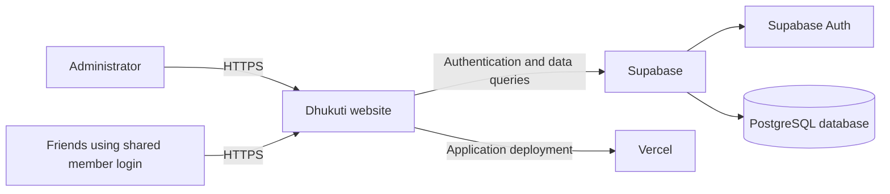
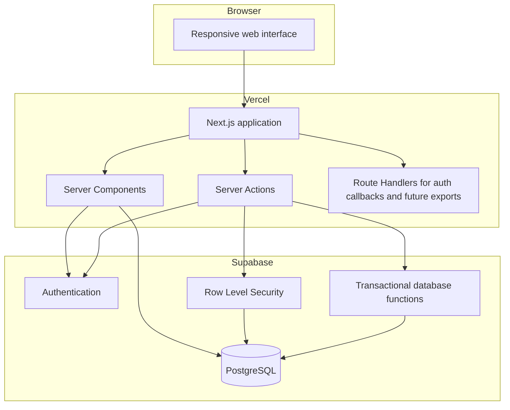
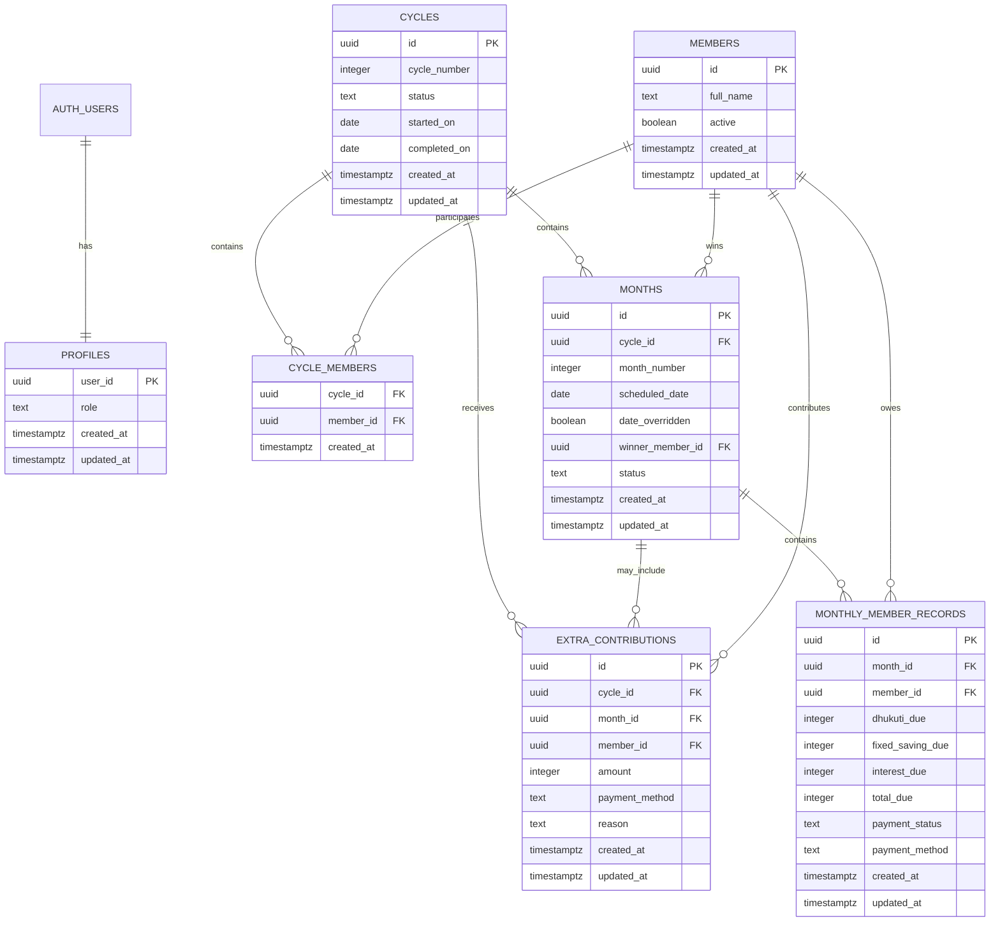
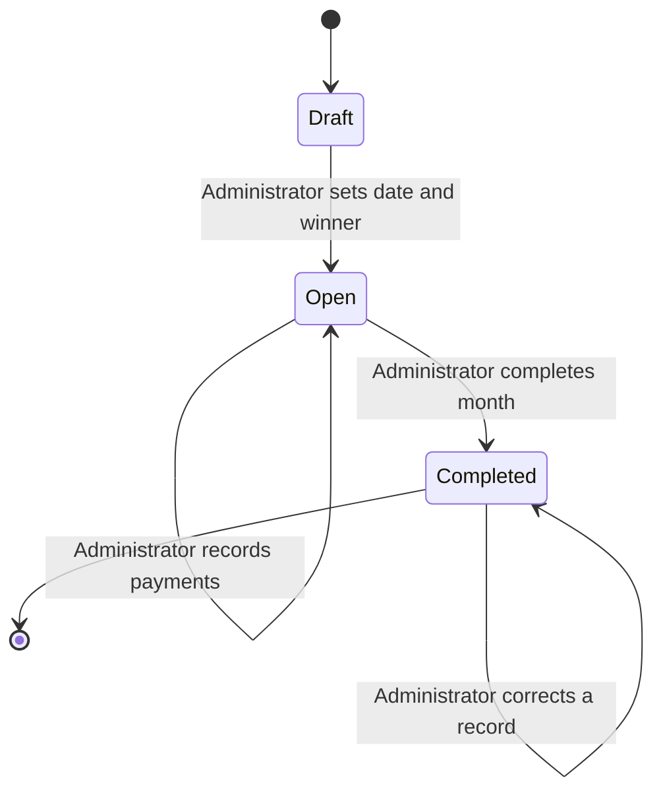
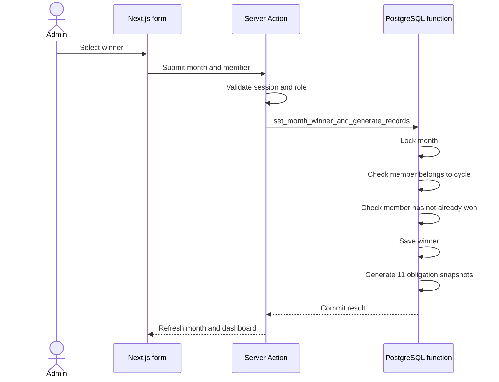
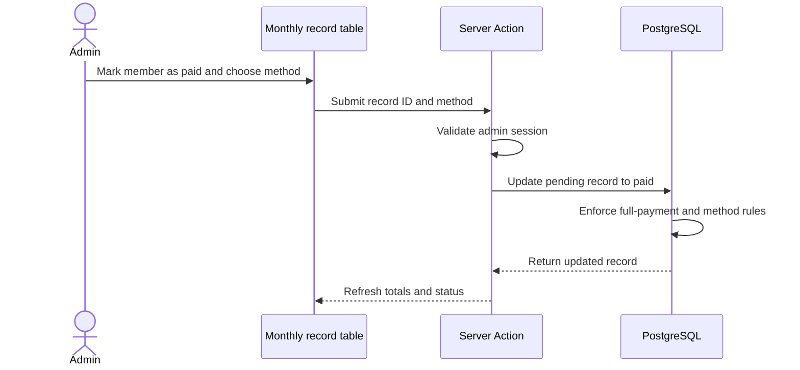
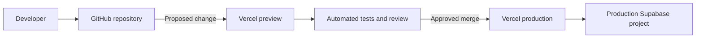

# School Friends Dhukuti Tracking Website

## System Design Document

| Document field | Value |
|---|---|
| Status | Proposed V1 architecture |
| Related document | [Product Requirements Document](./Dhukuti_Tracking_Website_PRD.md) |
| Product scope | Private transaction tracking website for 11 school friends |
| Architecture style | Modular full-stack web application |
| Document date | 18 September 2026 |

## 1 Executive summary

The website will be built as one full-stack Next.js application backed by a Supabase PostgreSQL database. Supabase will also provide authentication. The Next.js application will run on Vercel.

This design intentionally avoids microservices, background queues, a separate API server, and complex infrastructure. The application has 11 members, one administrator, low traffic, and a small relational dataset. A modular monolith is easier to build, secure, test, deploy, and maintain.

The main architectural principle is that every displayed balance must be calculated from recorded source data. The application will not maintain a manually editable current-balance field. PostgreSQL constraints and Row Level Security will protect financial records even if someone bypasses the user interface.

## 2 Goals

- Provide a private and reliable record of Dhukuti collections.
- Calculate monthly member obligations from the winner history.
- Show received and pending amounts without relying on spreadsheet formulas.
- Calculate the saving fund from fixed savings, interest, and extra contributions.
- Allow one administrator to maintain all records.
- Give the shared member account read-only access to the complete group history.
- Preserve records across multiple 11-month cycles.
- Support the manual entry and reconciliation of the 10 completed months in Cycle 1.
- Keep the architecture simple enough for one developer or a small team to maintain.

## 3 Non-goals for Version 1

- Processing eSewa, bank, or card payments
- Automatically selecting a Chitta winner
- Partial payments
- Late-payment penalties
- Receipt or screenshot uploads
- Saving-fund withdrawals
- Gathering expense management
- Birthday calendars or reminders
- Separate accounts for all 11 members
- Real-time chat or notifications
- Microservices or event-driven infrastructure

## 4 Architecture decisions

| Area | Decision | Reason |
|---|---|---|
| Application | Next.js with TypeScript | Frontend and server-side application logic remain in one codebase. |
| Interface | React Server Components with focused Client Components | Most pages are read-oriented; only forms and interactive controls need browser-side state. |
| Mutations | Next.js Server Actions | Admin forms can call secure server-side operations without maintaining a separate REST API. |
| Styling | Tailwind CSS | Supports a consistent, responsive, minimalist interface. |
| Database | Supabase PostgreSQL | The domain is relational and requires constraints, reports, transactions, and reliable aggregation. |
| Authentication | Supabase Auth | Provides secure sessions and password handling. |
| Authorization | PostgreSQL Row Level Security | Enforces read-only member access and administrator-only writes in the database. |
| Deployment | Vercel | Provides a direct deployment path for Next.js. |
| Database hosting | Supabase | Avoids maintaining a database server and authentication service. |
| Currency storage | Whole Nepalese rupees as integers | V1 uses whole-rupee amounts, and integer arithmetic avoids floating-point errors. |
| Dates | Gregorian dates with Asia Kathmandu as the application timezone | Matches the agreed monthly schedule and countdown behavior. |

## 5 System context



The administrator and members use the same website. Their authenticated role determines which actions are available. There is no public financial page.

## 6 Container architecture



### 6.1 Read path

1. The browser requests an authenticated page.
2. Next.js reads the Supabase session.
3. A Server Component queries the required database records.
4. Row Level Security verifies that the authenticated account may read the records.
5. The server renders the page and sends HTML to the browser.

### 6.2 Write path

1. The administrator submits a form.
2. A Server Action validates the session, role, input, and current record state.
3. The action performs a database mutation using the administrator's authenticated session.
4. Row Level Security independently checks that the account may write.
5. PostgreSQL constraints or a transactional database function validate the business rules.
6. Next.js refreshes the affected dashboard and history pages.

## 7 Authentication design

The system will contain two application accounts:

- One administrator account with read and write permission
- One shared member account with read-only permission

Supabase Auth uses email and password internally. The website can still display a username-and-password login form. The server maps the two accepted usernames to group-controlled Supabase account emails. The browser must never receive this mapping or any administrator secret.

The `profiles` table links each Supabase user to an application role.

| Role | Read | Create | Update | Delete |
|---|:---:|:---:|:---:|:---:|
| Administrator | Yes | Yes | Yes | Limited |
| Shared member | Yes | No | No | No |
| Unauthenticated visitor | No | No | No | No |

Deletion should be avoided for financial records. Corrections should normally update the existing record and its `updated_at` value. Where deletion is allowed during setup, it must be limited to the administrator and blocked after dependent records exist.

## 8 Authorization and Row Level Security

Row Level Security will be enabled for every application table exposed through Supabase.

The policy model is:

- Unauthenticated requests receive no table access.
- Authenticated administrators and members may select application records.
- Only the administrator may insert or update operational records.
- Only the administrator may perform restricted deletes during initial setup.
- The Supabase service-role key is never included in browser code.
- Normal runtime operations use the signed-in user's session so Row Level Security remains active.

The application should use a small database helper such as `is_admin()` to check the authenticated user's profile role consistently inside policies.

Authorization is checked twice: once in the Server Action for a clear application error and again in PostgreSQL for defense in depth.

## 9 Data model



## 10 Table definitions

### 10.1 profiles

Stores the application role for each Supabase Auth user.

| Field | Type | Rules |
|---|---|---|
| `user_id` | UUID | Primary key and foreign key to the Auth user |
| `role` | Text or enum | `admin` or `member` |
| `created_at` | Timestamp with timezone | Generated automatically |
| `updated_at` | Timestamp with timezone | Updated automatically |

### 10.2 members

Stores the school friends represented in financial records. These are not authentication accounts.

| Field | Type | Rules |
|---|---|---|
| `id` | UUID | Primary key |
| `full_name` | Text | Required and unique among active members |
| `active` | Boolean | Supports future membership changes without deleting history |
| `created_at` | Timestamp with timezone | Generated automatically |
| `updated_at` | Timestamp with timezone | Updated automatically |

### 10.3 cycles

Stores each 11-month Dhukuti chapter.

| Field | Type | Rules |
|---|---|---|
| `id` | UUID | Primary key |
| `cycle_number` | Integer | Required and unique |
| `status` | Enum | `draft`, `active`, or `completed` |
| `started_on` | Date | Gregorian calendar date |
| `completed_on` | Date | Nullable until completion |
| `created_at` | Timestamp with timezone | Generated automatically |
| `updated_at` | Timestamp with timezone | Updated automatically |

### 10.4 cycle_members

Connects members to a cycle so future cycles can have a different roster without changing old records.

| Field | Type | Rules |
|---|---|---|
| `cycle_id` | UUID | Foreign key to `cycles` |
| `member_id` | UUID | Foreign key to `members` |
| `created_at` | Timestamp with timezone | Generated automatically |

The combination of `cycle_id` and `member_id` is unique. Version 1 validates that Cycle 1 contains exactly 11 members before it becomes active.

### 10.5 months

Stores one monthly Dhukuti event.

| Field | Type | Rules |
|---|---|---|
| `id` | UUID | Primary key |
| `cycle_id` | UUID | Foreign key to `cycles` |
| `month_number` | Integer | Between 1 and 11 |
| `scheduled_date` | Date | Defaults to the last Saturday and can be overridden |
| `date_overridden` | Boolean | Indicates an exceptional schedule |
| `winner_member_id` | UUID | Nullable until the administrator records the winner |
| `status` | Enum | `draft`, `open`, or `completed` |
| `created_at` | Timestamp with timezone | Generated automatically |
| `updated_at` | Timestamp with timezone | Used for the last-updated indicator |

Required uniqueness rules:

- One month number per cycle
- One winner per month
- One winning month per member per cycle

### 10.6 monthly_member_records

Stores the calculated obligation and payment state for one member in one month.

| Field | Type | Rules |
|---|---|---|
| `id` | UUID | Primary key |
| `month_id` | UUID | Foreign key to `months` |
| `member_id` | UUID | Foreign key to `members` |
| `dhukuti_due` | Integer | `0` or `2000` |
| `fixed_saving_due` | Integer | `100` |
| `interest_due` | Integer | `0` or `200` |
| `total_due` | Integer | Sum of the three components |
| `payment_status` | Enum | `pending` or `paid` |
| `payment_method` | Enum | `esewa`, `bank_transfer`, `cash`, or null while pending |
| `created_at` | Timestamp with timezone | Generated automatically |
| `updated_at` | Timestamp with timezone | Used for corrections and last-updated display |

The combination of `month_id` and `member_id` is unique. Partial payment fields are intentionally excluded.

### 10.7 extra_contributions

Stores voluntary amounts that go directly into the saving fund.

| Field | Type | Rules |
|---|---|---|
| `id` | UUID | Primary key |
| `cycle_id` | UUID | Foreign key to `cycles` |
| `month_id` | UUID | Optional foreign key to a month |
| `member_id` | UUID | Contributor |
| `amount` | Integer | Required and greater than zero |
| `payment_method` | Enum | `esewa`, `bank_transfer`, or `cash` |
| `reason` | Text | Optional and visible to members |
| `created_at` | Timestamp with timezone | Recorded automatically; no date input is required |
| `updated_at` | Timestamp with timezone | Updated automatically |

## 11 Business calculation engine

The calculation logic should be implemented as pure TypeScript functions for unit testing and repeated as database constraints or transactional checks where appropriate.

### 11.1 Member obligation

```text
if member is the current winner:
    dhukuti_due = 0
    fixed_saving_due = 100
    interest_due = 0
    total_due = 100

else if member won in an earlier month of the same cycle:
    dhukuti_due = 2000
    fixed_saving_due = 100
    interest_due = 200
    total_due = 2300

else:
    dhukuti_due = 2000
    fixed_saving_due = 100
    interest_due = 0
    total_due = 2100
```

The component amounts are stored as a historical snapshot when the winner is confirmed. This prevents later rule or roster changes from altering completed records.

### 11.2 Monthly payout

```text
monthly winner payout = 10 × रु 2,000 = रु 20,000
```

The payout is calculated and displayed. Version 1 does not store an outgoing transfer confirmation.

### 11.3 Saving balance

```text
actual saving balance
= sum of fixed_saving_due for paid monthly records
+ sum of interest_due for paid monthly records
+ sum of extra contributions
```

Pending records contribute zero to the actual balance. Their saving and interest components remain visible as pending.

### 11.4 Baseline saving progression

For cycle month `m`, where `m` is between 1 and 11:

```text
fixed saving due = 11 × रु 100 = रु 1,100
interest due = (m - 1) × रु 200
monthly baseline saving = रु 1,100 + interest due
```

Expected baseline checkpoints:

| Checkpoint | Baseline saving |
|---|---:|
| After Month 9 | रु 17,100 |
| After Month 10 | रु 20,000 |
| After Month 11 | रु 23,100 |

Extra contributions and pending payments explain any difference between the baseline and actual balance.

## 12 Monthly lifecycle



The system does not automatically mark payments overdue. A generated member obligation begins as `pending` and becomes `paid` only when the administrator records receipt of the full amount.

## 13 Winner and obligation generation

Recording a winner and generating 11 obligations must be atomic. The recommended implementation is a PostgreSQL function called by a Server Action.



If any validation fails, the transaction rolls back and creates no partial records.

## 14 Payment workflow



Changing a paid record back to pending is treated as an administrator correction. The original month's totals and all cumulative balances must recalculate immediately.

## 15 Meeting schedule and countdown

When a month is created, the application calculates the last Saturday of that Gregorian calendar month and saves it as `scheduled_date`.

The administrator can replace this date for an exceptional month. The override changes only that month. Future months continue to use their own calculated last Saturdays.

The countdown is calculated when the page is rendered:

```text
days remaining = scheduled meeting date - current date in Asia Kathmandu
```

The countdown does not require a scheduled background job.

## 16 Application modules

```text
src/
├── app/
│   ├── login/
│   ├── dashboard/
│   ├── months/
│   ├── savings/
│   ├── history/
│   ├── members/
│   └── admin/
├── components/
│   ├── dashboard/
│   ├── payments/
│   ├── tables/
│   └── forms/
├── domain/
│   ├── dhukuti-calculations.ts
│   ├── schedule.ts
│   ├── validation.ts
│   └── types.ts
├── server/
│   ├── actions/
│   ├── queries/
│   ├── auth/
│   └── supabase/
└── tests/
    ├── unit/
    ├── integration/
    └── e2e/
```

The `domain` directory contains pure business logic without React or database dependencies. This makes financial calculations easy to test.

## 17 Server operations

Version 1 should expose the following internal operations through Server Actions:

| Operation | Permission | Purpose |
|---|---|---|
| `signIn` | Public login page | Authenticate the admin or member account |
| `signOut` | Authenticated | End the current session |
| `createCycle` | Admin | Create a draft cycle and its roster |
| `createMonth` | Admin | Create a month with its default last-Saturday date |
| `setMonthWinner` | Admin | Record the winner and generate obligation snapshots atomically |
| `setPaymentPaid` | Admin | Mark a full obligation paid and save its method |
| `setPaymentPending` | Admin | Correct a paid record back to pending |
| `addExtraContribution` | Admin | Add voluntary saving funds |
| `updateExtraContribution` | Admin | Correct an extra contribution |
| `overrideMeetingDate` | Admin | Change one month's scheduled date |
| `completeMonth` | Admin | Mark the month completed after review |
| `startNextCycle` | Admin | Reset winner and interest state while preserving history |

Route Handlers are not needed for normal forms. They can be added later for downloads, integrations, or a health endpoint.

## 18 Validation and database constraints

The database must enforce the following rules in addition to application validation:

- A cycle number is unique.
- A month number is between 1 and 11.
- A cycle cannot contain two records for the same month number.
- A member appears only once in a cycle roster.
- A member has only one monthly record per month.
- A member cannot win twice in the same cycle.
- A winner must belong to that cycle.
- `dhukuti_due` is either 0 or 2000.
- `fixed_saving_due` is 100.
- `interest_due` is either 0 or 200.
- `total_due` equals the sum of its three components.
- A paid record requires a payment method.
- A pending record has no payment method.
- Extra contribution amounts are positive integers.
- Payment and cycle statuses use controlled enum values.

## 19 Dashboard query design

Dashboard values should be derived from base records or security-invoker database views.

### 19.1 Current-month summary

- Current winner
- Calculated winner payout
- Total due
- Total received
- Total pending
- Paid member count
- Pending member count

### 19.2 Saving summary

- Received fixed savings
- Received interest
- Extra contributions
- Saving from previous cycles
- Current overall saving balance
- Pending fixed savings and interest shown separately

### 19.3 Winner summary

- Members who already won
- Winning month for each winner
- Members still eligible
- Current cycle progress

The initial data volume is small, so live aggregate queries are sufficient. Cached summary tables are not required for Version 1.

## 20 Security design

### 20.1 Application security

- Require authentication for every product page.
- Redirect unauthenticated requests to the login page.
- Verify the role inside every administrator Server Action.
- Validate all input with a server-side schema.
- Do not trust totals sent by the browser; calculate them on the server.
- Use secure, HTTP-only session cookies through the supported Supabase Next.js integration.
- Add protection against repeated login attempts through the authentication provider's controls.

### 20.2 Database security

- Enable Row Level Security on all application tables.
- Revoke unnecessary privileges from anonymous and authenticated database roles.
- Create separate policies for select, insert, update, and delete.
- Keep the service-role key server-only and out of the normal request path.
- Use transactional functions for multi-record financial operations.

### 20.3 Shared member credential risk

The shared member account is an accepted product decision, but it has one known risk: the password cannot be revoked for one friend without changing it for everyone. The administrator should change the shared password if it is disclosed outside the group.

## 21 Reliability and backup

- Store all database changes through version-controlled migrations.
- Use separate development and production Supabase projects.
- Enable the backup level appropriate to the chosen Supabase plan.
- Produce a periodic logical export independent of the hosting provider.
- Take an export after completing each monthly Dhukuti record.
- Test restoration before relying on the backup process.
- Do not treat the Google Sheet as the ongoing source of truth after migration is approved.

Supabase database backups cover PostgreSQL data. Version 1 does not store uploaded files, so no separate object-storage backup is required.

## 22 Observability

Version 1 needs lightweight operational visibility rather than a large monitoring stack.

- Use Vercel application logs for server errors.
- Use Supabase database and authentication logs for failed queries and sign-ins.
- Log failed administrator actions with an operation name and request identifier, without logging passwords or secrets.
- Display a clear error to the administrator when a transaction fails.
- Add an external error tracker only if operational experience shows that built-in logs are insufficient.

## 23 Performance and scalability

The database will initially contain only hundreds of rows. Standard indexed queries will be sufficient.

Recommended indexes:

- `months(cycle_id, month_number)`
- `months(cycle_id, winner_member_id)`
- `monthly_member_records(month_id, member_id)`
- `monthly_member_records(payment_status)`
- `extra_contributions(cycle_id, month_id)`

Server Components should load only the data required by the active page. The member table may be rendered directly without pagination because it contains 11 rows. History can be grouped by cycle and month.

The architecture can support substantially more groups later, but multi-group tenancy is not part of Version 1. Adding it would require a `groups` table and a `group_id` boundary in every policy and business table.

## 24 Environment and configuration

Use separate local, preview, and production environments.

| Environment | Purpose |
|---|---|
| Local | Development with test data |
| Preview | Automatic Vercel deployment for each proposed change |
| Production | Real group data |

Expected configuration values include:

```text
NEXT_PUBLIC_SUPABASE_URL
NEXT_PUBLIC_SUPABASE_ANON_KEY
ADMIN_LOGIN_ACCOUNT
MEMBER_LOGIN_ACCOUNT
APP_TIMEZONE=Asia/Kathmandu
```

Any service-role secret used for migrations or controlled maintenance must remain server-only and must not use a `NEXT_PUBLIC` prefix.

## 25 Testing strategy

### 25.1 Unit tests

Test pure calculation and schedule functions:

- Current winner owes रु 100.
- A member who has not won owes रु 2,100.
- A previous winner owes रु 2,300.
- Interest starts in the month after winning.
- Interest resets in the next cycle.
- Month 10 baseline saving equals रु 20,000.
- Month 11 baseline saving equals रु 23,100.
- The last-Saturday calculation is correct for different month lengths.

### 25.2 Database tests

- A member cannot win twice in one cycle.
- A member account cannot insert or update records.
- An unauthenticated request cannot select financial records.
- A paid record cannot have a missing payment method.
- A pending record cannot contribute to actual saving totals.
- Winner generation either creates all 11 records or creates none.

### 25.3 Integration tests

- Administrator records a winner and sees 11 obligations.
- Administrator marks a payment paid and totals update correctly.
- Administrator corrects a prior month and cumulative totals recalculate.
- Administrator adds an extra contribution and the saving balance increases.
- Starting Cycle 2 resets eligibility and interest while preserving the saving balance.

### 25.4 End-to-end tests

- Administrator login and monthly recording flow
- Shared member login and read-only behavior
- Member attempt to access an administrator action
- Exceptional meeting-date override and countdown
- Historical month entry and reconciliation
- Mobile and desktop navigation

## 26 Historical data migration

The 10 completed months of Cycle 1 will be entered through the administrator interface.

### 26.1 Migration sequence

1. Create the 11 member records.
2. Create Cycle 1 with all 11 members.
3. Create Months 1 through 10 with their actual meeting dates.
4. Record the 10 different winners in the correct order.
5. Generate the 11 member obligations for each month.
6. Mark each received payment as paid and record its method.
7. Leave any unpaid amount pending in its original month.
8. Enter every known extra contribution and reason.
9. Compare each month's result with the Google Sheet.
10. Reconcile the actual saving balance against the रु 20,000 baseline after Month 10.

### 26.2 Reconciliation rule

Every difference from the baseline must be explained by a pending fixed saving, pending interest, or an extra contribution. The system must not use an unexplained opening-balance adjustment to force the totals to match.

## 27 Deployment design



Database migrations should run as a controlled deployment step before application code that depends on them. Destructive schema changes require a backup and an explicit migration plan.

## 28 Build sequence

### Phase 1 Project foundation

- Create the Next.js TypeScript project.
- Configure Tailwind CSS.
- Create development and production Supabase projects.
- Add migration tooling and environment configuration.
- Establish the main page layout and navigation.

### Phase 2 Database and security

- Create tables, enums, constraints, indexes, and timestamp triggers.
- Create the two authentication accounts and profile roles.
- Implement and test Row Level Security.
- Create test fixtures for an 11-member cycle.

### Phase 3 Domain logic

- Implement obligation calculations as pure functions.
- Implement last-Saturday scheduling.
- Implement winner eligibility checks.
- Create the atomic winner-and-obligation database function.
- Add unit and database tests.

### Phase 4 Administrator workflow

- Build cycle and month administration.
- Build winner recording.
- Build the monthly payment table.
- Add payment status and method controls.
- Add extra contributions and schedule overrides.
- Allow corrections to completed months.

### Phase 5 Member experience

- Build the dashboard.
- Build monthly and cycle history.
- Build the saving-fund breakdown.
- Build winner and eligibility views.
- Add the next-meeting countdown.

### Phase 6 Historical migration

- Enter and verify the 10 completed months.
- Reconcile pending payments and extra contributions.
- Confirm the remaining Month 11 winner.
- Obtain group approval of the migrated totals.

### Phase 7 Production readiness

- Complete security and permission testing.
- Complete mobile and desktop testing.
- Configure production backups and exports.
- Deploy to Vercel.
- Change from test credentials to group-controlled credentials.

## 29 Risks and mitigations

| Risk | Impact | Mitigation |
|---|---|---|
| Shared member password is disclosed | An outsider could view group records | Change the shared password and invalidate active sessions. Consider individual accounts in a later version. |
| Administrator records an incorrect payment | Dashboard totals become inaccurate | Allow corrections, display `updated_at`, and reconcile monthly totals before completion. |
| Calculation logic differs between screens | Conflicting totals | Keep calculations in shared domain functions and verify them with database constraints and tests. |
| Historical data is entered incorrectly | Initial balance and winner history are wrong | Reconcile month by month against the Google Sheet before launch. |
| Hosting or database account is lost | Service interruption or data loss | Use group-controlled accounts, version-controlled migrations, and independent logical exports. |
| A future rule change alters old records | Historical figures become inconsistent | Store monthly obligation components as immutable snapshots. |
| Service-role secret reaches the browser | Database authorization could be bypassed | Do not include the key in public environment variables or normal client code. |

## 30 Future evolution

The current design can be extended without changing its core architecture.

Potential additions include:

- Saving-fund withdrawals and a full fund ledger
- Birthday and event calendars
- Individual member accounts
- Email or push reminders
- Receipt attachments using Supabase Storage
- CSV or PDF exports
- Detailed audit history
- Multiple Dhukuti groups
- Configurable contribution and interest amounts

If withdrawals are introduced, the system should add an explicit saving-ledger entry for every deposit and withdrawal. It should not modify earlier payment records to represent spending.

## 31 Final architecture decision

Version 1 will use Next.js, TypeScript, Tailwind CSS, Supabase PostgreSQL, Supabase Auth, Row Level Security, and Vercel. It will be implemented as one modular full-stack application with PostgreSQL as the source of truth.

The design prioritizes accurate financial calculations, simple administration, read-only transparency for members, and a clear migration path from the current Google Sheet.

## 32 Technical references

- [Next.js backend for frontend guidance](https://nextjs.org/docs/app/guides/backend-for-frontend)
- [Supabase Next.js quickstart](https://supabase.com/docs/guides/getting-started/quickstarts/nextjs)
- [Supabase database overview](https://supabase.com/docs/guides/database/overview)
- [Supabase Row Level Security](https://supabase.com/docs/guides/database/postgres/row-level-security)
- [Supabase authentication architecture](https://supabase.com/docs/guides/auth/architecture)
- [Supabase database backups](https://supabase.com/docs/guides/platform/backups)
- [Next.js on Vercel](https://vercel.com/docs/frameworks/full-stack/nextjs)
